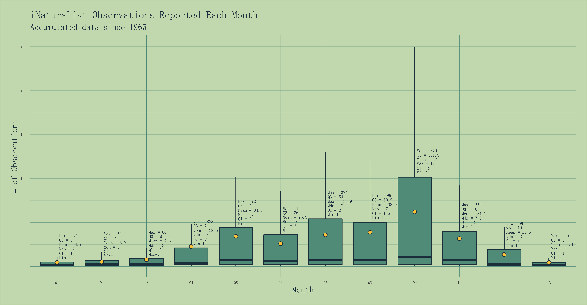

# iNat
Began learning data visualization with R using data from [iNaturalist](https://www.inaturalist.org). This is a collection of some of the things I have made.

- **iNat data** = *data.csv* 
- **Weather data** = *weather.csv*

Find more recent things in [gbif](https://github.com/jmahr07/gbif) and [tidytuesday](https://github.com/jmahr07/tidytuesday) repos.

***

## Here they are in no particular order:
### Nov. 2022 - [Squirrels](squirrels/)

### Dec. 2022 - [Observation Stats](five_number/)

### Nov. 2022 - [Observations & Weather](obs_weather/)

### Dec. 2022 - [Observations & Rainfall](raincloud/)

### Dec. 2022 - [Class & Temperature](class_temp/)

### Nov. 2022 - [Class Observations Over Time](class_count/)

### Nov. 2022 - [Top Birds by Species & Order](top_birds/)

