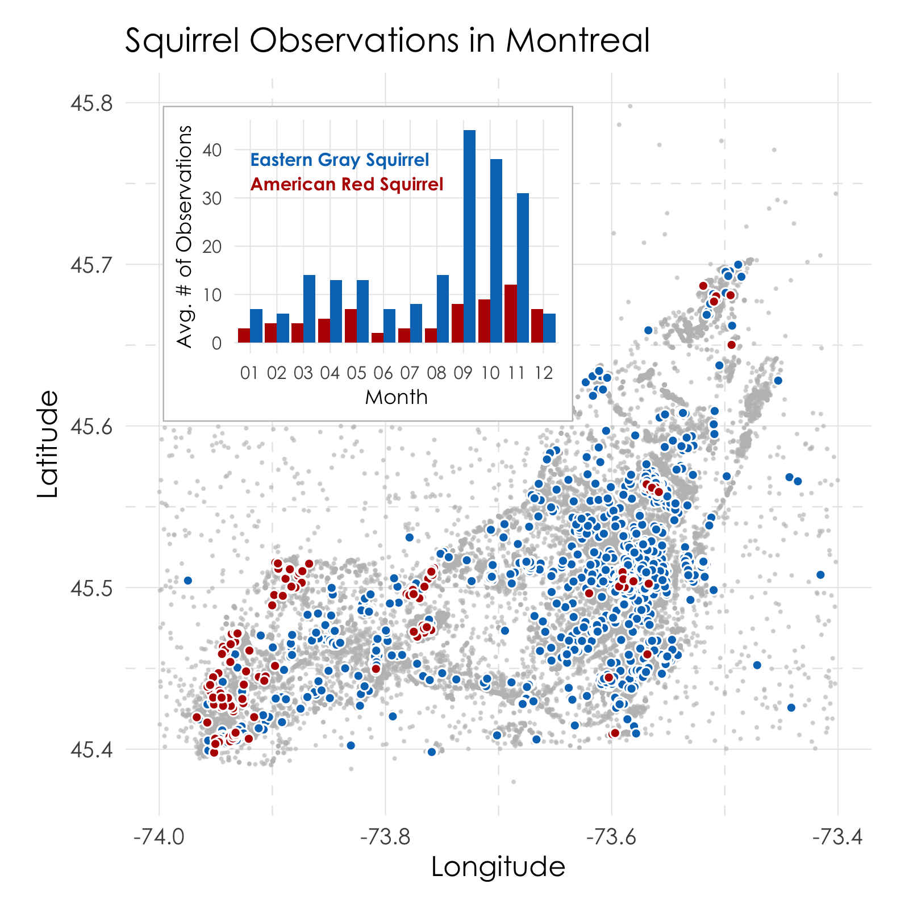
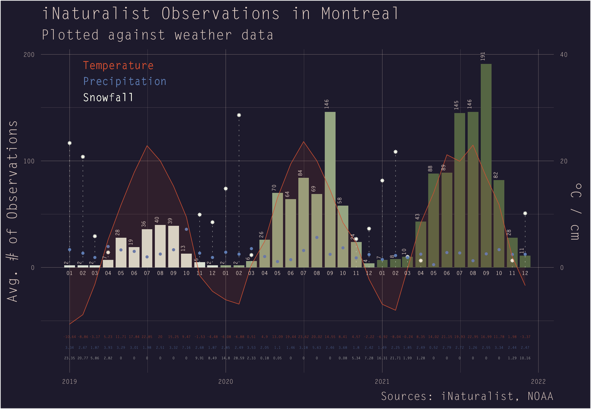
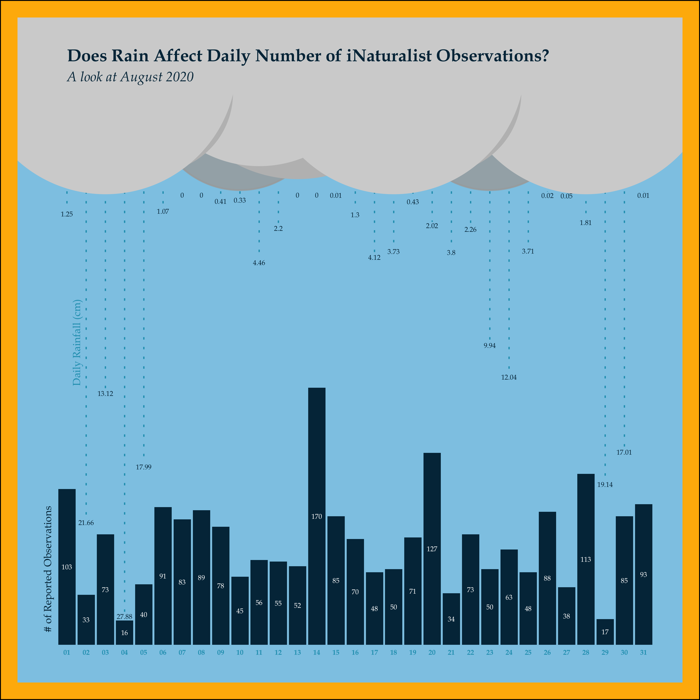
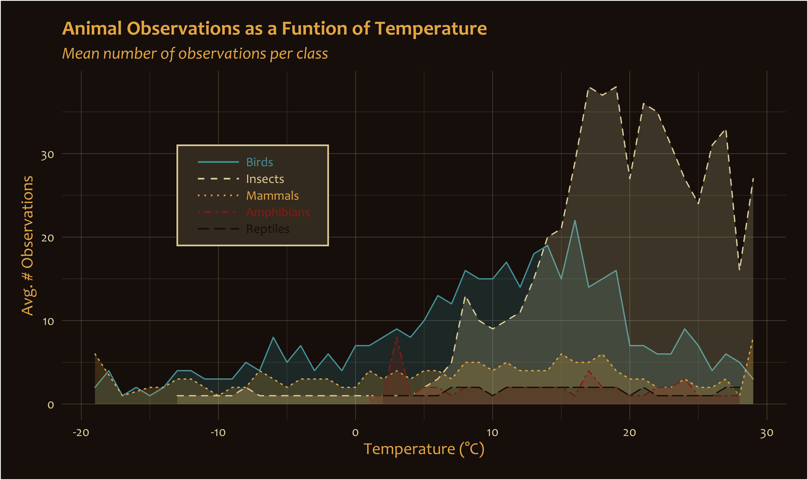

# iNat
Learning data visualization with R using data from iNaturalist. This is a collection of some of the things I have made.

**iNat data** = *data.csv* | **Weather data** = *weather.csv*

Also new to github so let me know if I am doing something wrong.

***

## Here are some highlights in no particular order:
### Nov. 2022 - [Squirrels](squirrels/)

### Nov. 2022 - [Observations & Weather](obs_weather/)

### Dec. 2022 - [Observations & Rainfall](raincloud/)

### Dec. 2022 - [Class & Temperature](class_temp/)

### Nov. 2022 - [Class Observations Over Time](class_count/)

